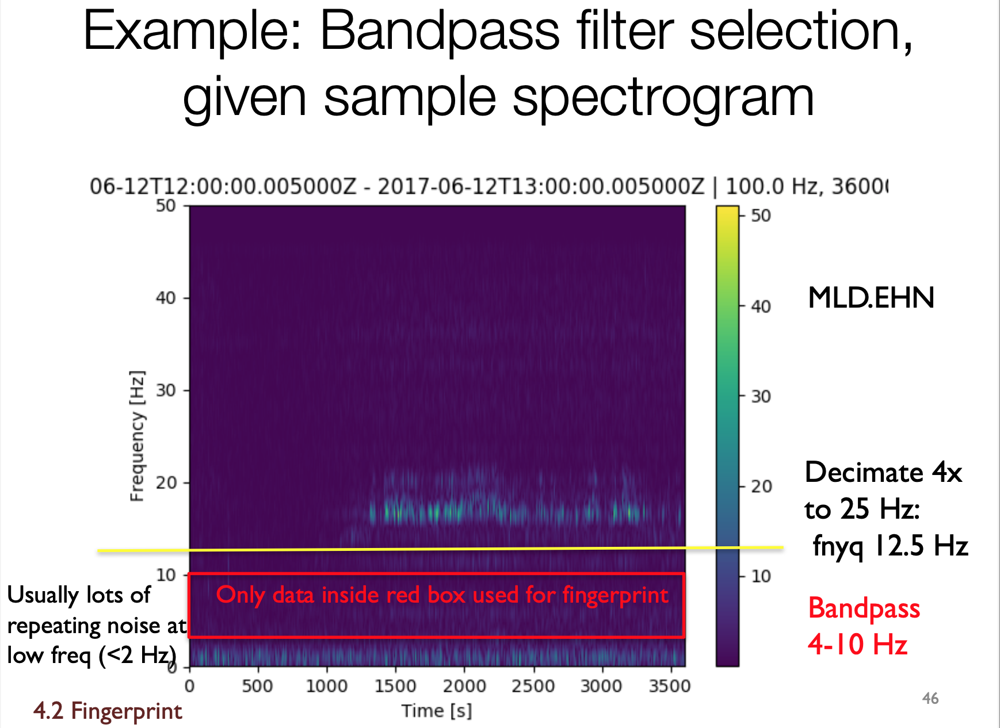

# Checklist for running FAST on Your Own Dataset

!!! info
    Follow along with the [tutorial](tutorial.md) section to make sure you follow the correct steps for FAST while using your own dataset.  

    In most cases, if something does not run correctly, there is likely an issue with the file path or file name that users must fix.

* Follow install instructions: [Google Colab](setup_colab.md), [Linux](setup_linux.md), or [Docker](setup_docker.md)
* [Get seismic data](get_seismic_data.md)
* Put seismic data folder in `~/FAST/data/`
* Plot sample spectrograms to decided decimate factor and min/max frequency. Python script found in `~/FAST/utils/preprocess`: `plot_sample_spectrograms.py`



* Check sampling rate of waveform data for decimate value

```
>>> st = read(“AZ.TONN*“)
>>> print(st)
3 Trace(s) in Stream:
AZ.TONN..HNE | 2021-06-05T00:00:00.001900Z - 2021-06-05T23:59:59.990308Z | 200.0 Hz, 17280000 samples
AZ.TONN..HNN | 2021-06-05T00:00:00.001900Z - 2021-06-05T23:59:59.990308Z | 200.0 Hz, 17280000 samples
AZ.TONN..HNZ | 2021-06-05T00:00:00.001900Z - 2021-06-05T23:59:59.990308Z | 200.0 Hz, 17280000 samples
```  

```
>>> st = read(“CI.CRR*“)
>>> print(st)
3 Trace(s) in Stream:
CI.CRR..HHE | 2021-06-05T00:00:00.008300Z - 2021-06-05T23:59:59.998300Z | 100.0 Hz, 8640000 samples
CI.CRR..HHN | 2021-06-05T00:00:00.008300Z - 2021-06-05T23:59:59.998300Z | 100.0 Hz, 8640000 samples
CI.CRR..HHZ | 2021-06-05T00:00:00.008300Z - 2021-06-05T23:59:59.998300Z | 100.0 Hz, 8640000 samples
```

* Choose sampling rate for fingerprinting:  

     * If chosen sampling rate is 25 Hz, and trace sampling rate is 200 Hz, choose a decimate factor of 8
     * If chosen sampling rate is 25 Hz, and trace sampling rate is 100 Hz, choose a decimate factor of 4  
   
* Use `~/FAST/utils/preprocess/bandpass_filter_decimate.py` and create a bash script similar to `~/FAST/utils/preprocess/mdl_bandpass_filter.sh` to filter waveforms. Make sure to change input directory and consider creating an output directory for the decimated waveform files.  

Change input directory in  `~/FAST/utils/preprocess/bandpass_filter_decimate.py`  

``` py linenums="65"
ts_dir = '/lfs/1/ceyoon/TimeSeries/NEP/waveforms'+station+'/' # change input directory to reference where your waveforms are

out_dir = '../../data/waveforms_decimated/' # consider creating an output directory 

if not os.path.exists(out_dir): # create directory if it doesn't exist
    os.mkdir(out_dir)
```  

Change where output files are written

``` py linenums="114"
st.write(ts_dir+str_prefix+file_str, format=format_str) # change ts_dir to out_dir
```  

```
>>> st = read(“AZ.TONN*“)
>>> print(st)
3 Trace(s) in Stream:
AZ.TONN..HNE | 2021-06-05T00:00:00.001900Z - 2021-06-05T23:59:59.990308Z | 200.0 Hz, 17280000 samples
AZ.TONN..HNN | 2021-06-05T00:00:00.001900Z - 2021-06-05T23:59:59.990308Z | 200.0 Hz, 17280000 samples
AZ.TONN..HNZ | 2021-06-05T00:00:00.001900Z - 2021-06-05T23:59:59.990308Z | 200.0 Hz, 17280000 samples
```  

The above waveform is 200 Hz, so the decimate factor should be 8, for the FAST fingerprint sampling rate to be 25 Hz:  

```
python bandpass_filter_decimate.py AZ TONN HNZ 4 12 8

# 4: min frequency
# 12: max frequency
# 8: decimate value
```

4 - 12 Hz is a good general min/max frequency range for most waveform files. The decimate value depends on the sampling rate. Follow the guide above to choose this value.

* Create [fingerprint input json files](f_p.md) for each channel at each station in your dataset. Example:  

```
{
    "fingerprint": {
        "sampling_rate": 25, # final sampling rate after decimating
        "min_freq": 4.0,
        "max_freq": 12.0,
        "spec_length": 6.0,
        "spec_lag": 0.12,
        "fp_length": 64,
        "fp_lag": 10,
        "k_coef": 400,
        "nfreq": 32,
        "mad_sampling_rate": 1,
        "mad_sample_interval": 86400
    },

    "performance": {
        "num_fp_thread": 16,
        "partition_len": 86400
    },

    "data": {
        "station": "WLA06",
        "channel": "HNE",
        "start_time": "21-06-05T00:00:00.0",
        "end_time": "21-06-06T00:00:00.0",
        "folder": "data/waveforms/", # folder where decimated waveform files are located
        "fingerprint_files": [
	    "Deci4.bp2to20.YR.ED04..HHZ.D.2016.303"],
        "MAD_sample_files": [
	    "Deci4.bp2to20.YR.ED04..HHZ.D.2016.303"]
    }
}
```

* Put all fp_input_NETWORK_STATION_CHANNEL.json files in `~/FAST/config.json` and `~/FAST/parameters/fingerprint/your_dataset_folder/global_indices.json`; Example:    

```
{
	"index_folder": "../data/global_indices/",
	"fp_param_dir": "../parameters/fingerprint/your_dataset_folder/", # fp_input_NETWORK_STATION_CHANNEL.json directory
	"fp_params": ["fp_input_CI_TPC_EHZ.json", "fp_input_CI_RMR_EHZ.json", "fp_input_CI_RMM_EHZ.json",
		"fp_input_CI_HEC_BHE.json", "fp_input_CI_HEC_BHN.json", "fp_input_CI_HEC_BHZ.json",
		"fp_input_CI_CPM_EHZ.json", "fp_input_CI_GTM_EHZ.json", "fp_input_CI_CDY_EHZ.json"]
}
```  

* After your data is ready, you can begin fingerprinting.  

* Make sure your `fp_input_NETWORK_STATION_CHANNEL.json` files are pointing to the correct decimated waveform files and directory otherwise FAST will not write to global index.

* Fingerprinting is complete when you see:  
  

* If you get an error when FAST tries to write global index, check `global_indices.json` to make sure there are not any disceprencies between `config.json` and `globali_indices.sjon`, such as a station being included in `config.json` but left out of `global_indices.json`

* Now you can begin [similarity search](sim_search.md)  

* Create an `output_Dataset_pairs.sh` script similar to `~/FAST/parameters/postprocess/output_HectorMine_pairs.sh` for your dataset.  
* Create an `combine_Dataset_pairs.sh` script similar to `~/FAST/parameters/postprocess/combine_HectorMine_pairs.sh` for your dataset.  

* Follow instructions for running `output_Dataset_pairs.sh` and `combine_Dataset_pairs.sh` in [Tutorial](tutorial.md).  

* If a station and its channels are stuck when merging files while running `combine_Dataset_pairs.sh`, remove it from `output_Dataset_pairs.sh`. Rerun `output_Dataset_pairs.sh` then `combine_Dataset_pairs.sh`.  

* Configure parameters in `~/FAST/parameters/postprocess/7sta_2stathresh_network_params.json` for your dataset. Change the 7 in the file name to the number of stations in your dataset.

* Run `python scr_run_network_det.py ../parameters/postprocess/7sta_2stathresh_network_params.json`

* Clean up results:  
    * Change file path in `arrange_network_detection_results.py` if you changed the file name of `7sta_2stathresh_network_params.json`
    * Change `nsta` to number of stations in your dataset in `arrange_network_detection_results.py` and `n_sta` in  `delete_overlap_network_detections.py`  
    * Also change file path name in `remove_duplicates_after_network.sh`, `delete_overlap_network_detections.py`, and `final_network_sort_nsta_peaksum.sh`  


```
~/FAST$ cd utils/network/
~/FAST/utils/network$ python arrange_network_detection_results.py
~/FAST/utils/network$ ./remove_duplicates_after_network.sh
~/FAST/utils/network$ python delete_overlap_network_detections.py
~/FAST/utils/network$ ./final_network_sort_nsta_peaksum.sh
```  

* Continue with next steps in tutorial  

* Plot detected earthquakes (change file paths in `PARTIALplot_detected_waveforms_HectorMine.py`):  

``` py linenums="24"
[det_start_ind, det_end_ind, dL, nevents, nsta, tot_ndets, max_ndets, tot_vol, max_vol, peaksum, num_sta, diff_ind] = np.loadtxt(times_dir+'sort_nsta_peaksum_6sta_2stathresh_FinalUniqueNetworkDetectionTimes.txt', usecols=(0,1,2,3,4,5,6,7,8,9,10,11), unpack=True) # change file name
out_dir = times_dir+'6sta_2stathresh_NetworkWaveformPlots/' # change file name
```  
* Change start time  

``` py linenums="39"
init_time = UTCDateTime('2021-06-05T00:00:00.00') # global start time for all channels
```

* Change directory for waveform files and change format if different  

``` py linenums="50"
st = read(ts_dir+'waveforms_priority_BP/Deci*', format='MSEED') 
```  

(Steps in tutorial)  
```
~/FAST/utils/network$ cd ..
~/FAST/utils$ cd events/
~/FAST/utils/events$ python PARTIALplot_detected_waveforms_HectorMine.py 0 100
```  

* Continue with next step of setting threshold  

* Make changes to `output_final_detection_list.py`:  

``` py linenums="10"
infile_name = 'EQ_sort_nsta_peaksum_6sta_2stathresh_FinalUniqueNetworkDetectionTimes.txt'
outfile_name = times_dir+'FINAL_Detection_List_HectorMine_6sta_2stathresh.txt'
init_time = UTCDateTime('2021-06-05T00:00:00.00') # global start time for all channels
```   

Now, follow the steps in [Phase Picking](phase_picking.md) and [Earthquake Location](earthquake_location.md).  