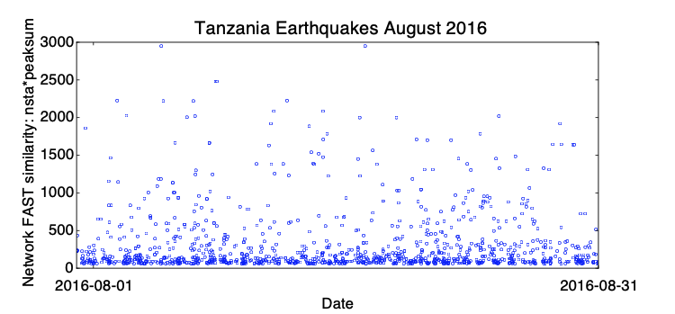
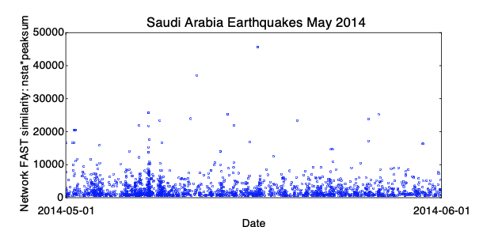
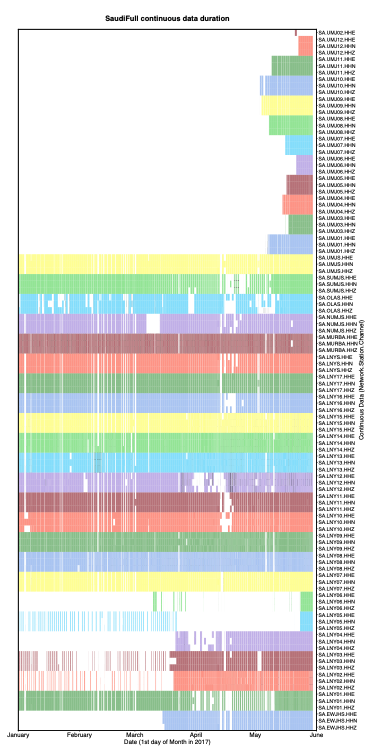
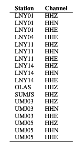
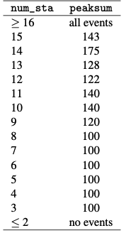
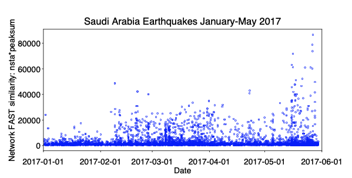
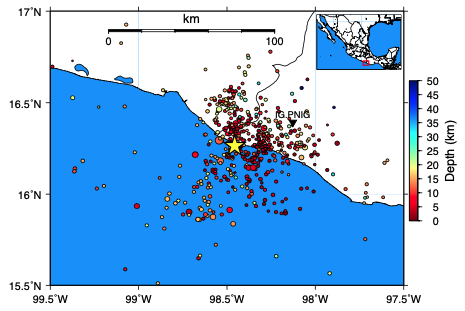
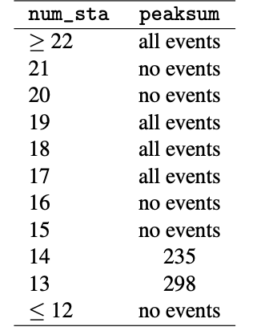
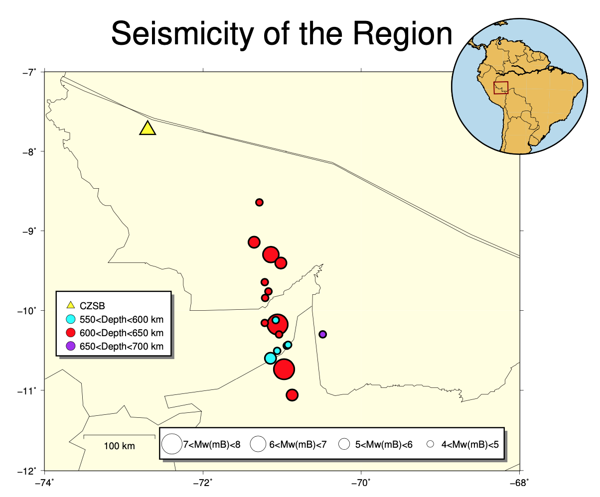

# **Example Parameters**

## 0.1 Introduction  

FAST is available to the public at [https://github.com/stanford-futuredata/FAST](https://github.com/stanford-futuredata/FAST) as open-source software, and it will be released with a comprehensive user manual containing guidance for setting parameters. Interested users can run FAST to perform an uninformed search for earthquakes with similar waveforms on any seismic network, with varying duration of continuous data and number of stations. The FAST software has successfully detected earthquakes in the following data sets. FAST will only reach its full potential as a tool for seismological discovery if other users apply it to their own data sets (filling the N and T gaps in Figure 1) and improve the detection algorithms. Thank you to all collaborators and interested users who shared data, which was useful for testing the FAST software and identifying bug fixes, in preparation for its public release.  

  

<figcaption>Figure 1: Dimensions of different data sets where FAST has successfully detected similar earthquakes. The log-scale axes represent the directions of data growth in seismology to ”large-T” and ”large-N” big data sets (Chapters 1 and 5): T is the longest duration of continuous data over all stations in the data set, while N is the number of seismic stations in the data set. Blue stars: data sets from Chapters 2-5. Red stars: additional data sets from Appendix A, Sections A.1-A.6.</figcaption>  

## 0.2 `ItalyDayYR` Data Set  

!!! info  
    One day of continuous data, 2016-10-29 00:00:00 to 2016-10-29 23:59:59 UTC, at 22 stations in central Italy (Figure 2), used 22 channels (vertical component HHZ only on each channel) for detection, provided by Bill Ellsworth. This data records small earthquakes from a swarm in Central Italy during October 2016, that occurred between the Mw 6.1 earthquake on 2016-10-26 19:18:08 UTC and the Mw 6.6 Norcia earthquake on 2016-10-30 06:40:18 UTC.  

  

<figcaption>Figure 2: Map of 22 stations (black triangles) in central Italy used for FAST detection of small earthquakes on 2016-10-29, one day of continuous data. The INGV catalog (http://cnt.rm.ingv.it/search) had 482 earthquakes (circles colored by depth, sized by relative magnitudes 0.4 ≤ M ≤ 4.1) inside the boundaries of this map on 2016-10-29.</figcaption>  

### 0.2.1 Preprocessing  

Output sample spectrograms on each channel and station to determine bandpass filter range:  

```
~/FAST/utils/preprocess/$ ../../parameters/preprocess/ItalyDayYR/sample_spectrograms_ItalyDayYR.sh
```  

Table S2: FAST input parameters for Italy earthquake detection: single-channel at 22 YR stations (Figure 2, black triangles), after bandpass filter 2-20 Hz, and decimate to 25 Hz. Total number of fingerprints: 71,989.  

<!-- | FAST Parameter      | Value                          |
| ----------- | ------------------------------------ |
| Time series window length for spectrogram generation       |     150 samples (6 s)  |
| Time series window lag for spectrogram generation       |  3 samples (0.12 s) |
| Spectral image window length      |  64 samples (13.68 s) |
| Spectral image window lag = fingerprint sampling period    |      10 samples (1.2 s) |
| Number of top k amplitude standardized Haar coefficients       |  400 (out of 2048) |
| LSH: number of hash functions per hash table r       |  4 |
| LSH: number of hash tables b       |  100 |
| Initial pair threshold: number v (fraction) of tables, pair in same bucket       |  2 (2/100 = 0.02) |
| Similarity search: near-repeat exclusion parameter       |  5 samples (6 s) | -->

  

Table S3: Network detection input parameters for Italy earthquakes at 22 YR stations (HHZ channel only), after getting similar pairs of fingerprints from FAST for each station.  

  

  

<figcaption>Figure 3: Distribution of FAST detections in central Italy continuous data on 2016-10-29. FAST detected a total of 1,485 earthquakes during this day.</figcaption>  

## 0.3 Tanzania, August 2016  

Temporary dense deployment of seismic stations in Tanzania to identify previously unknown faults and infer their dimensions. 1 month continuous data (2016-07-31 to 2016-08-31), at 5 stations, 15 channels (3 components per station), provided by Laura Parisi of King Abdullah University of Science and Technology (KAUST). The stations are located about 10 km apart, at the base of a volcanic caldera called Ngorongoro Crater. For all 15 channels, we applied the following preprocessing: 4-12 Hz bandpass filter, then decimated to 25 Hz (factor of 8, from original 200 Hz); also, all time gaps with 0’s were filled with uncorrelated random noise (only on station CES04).  


Table S4: FAST input parameters for Tanzania earthquake detection, applied to each component at all 5 stations. For the median statistics calculation (for wavelet coefficient selection), we randomly sampled 10% of the data, once per day. Total number of fingerprints (largest number over all channels): 2,231,989.  

  

Table S5: Network detection input parameters for Tanzania earthquakes at 5 stations, after getting similar pairs of fingerprints from FAST for each station — added similarity from all 3 [HNE,HNN,HNZ] components at a given station and set station-pair threshold of (v=2)*(3 components) = 6.  

  

Table S6: Final thresholds for Tanzania earthquakes, applied to network detection parameters *nsta* (number of stations that detected event pair) and *peaksum* (total similarity score at all stations) to determine list of earthquakes, set empirically after visual inspection. For each value of *nsta*, a different threshold for *peaksum* can be applied.  

  

  

<figcaption>Figure 4: Tanzania earthquake detections from 2016-07-31 to 2016-08-31. The vertical axis indicates a measure of network FAST similarity: nsta*peaksum (Table S6). FAST detected a total of 1,156 earthquakes during this month. Some false positive detections had to be removed manually, especially detections on only 2 out of 5 stations.</figcaption>  

## 0.4 Saudi Arabia, May 2014


<figcaption>Figure 5: Map of 19 stations (white triangles) in Saudi Arabia used for FAST detection from 2014-05-01 to 2014-06-01. Catalog earthquakes are colored by depth; mantle earthquakes are circled. This figure was created by Alex Blanchette.</figcaption>  


!!! info
    Seismic network from Saudi Arabia to study dike swarms in volcanic area, and deep mantle earthquakes. 1 month continuous data (2014-05-01 to 2014-06-01), at 19 stations (Figure 5), 55 channels (3 components per station, except LNY11 where only HHN was used), provided by Alex Blanchette of Stanford Geophysics.  

Table S7: Preprocessing parameters for Saudi Arabia May 2014 earthquake detection, for each station (same filter applied to all components), 1 month continuous data (2014-05-01 to 2014-06-01), at 19 stations, decimate to 25 Hz. Also, all time gaps with 0’s were filled with uncorrelated random noise. For station LNY11, only HHN component was used in similarity search, as the HHE and HHZ components had too much correlated noise.  

  


Table S8: FAST input parameters for Saudi Arabia May 2014 earthquake detection, applied to each component at each station. For the median statistics calculation (for wavelet coefficient selection), we randomly sampled 10% of the data, once per day. Total number of fingerprints (largest number over all channels): 2,231,989.  

  

Table S9: Network detection input parameters for Saudi Arabia May 2014 earthquake detection at 19 stations, after getting similar pairs of fingerprints from FAST for each station — added similarity from all 3 [HHE,HHN,HHZ] components at a given station and set station-pair threshold of (v=2)*(3 components) = 6.  

  

Table S10: Final thresholds for Saudi Arabia May 2014 earthquake detection, applied to network detection parameters *nsta* (number of stations that detected event pair) and *peaksum* (total similarity score at all stations) to determine list of earthquakes, set empirically after visual inspection. For each value of *nsta*, a different threshold for *peaksum* can be applied.  

  

  

<figcaption>Figure 6: Saudi Arabia earthquake detections from 2014-05-01 to 2014-06-01. The vertical axis indicates a measure of network FAST similarity: nsta*peaksum (Table S10). FAST detected a total of 1,837 earthquakes during this month.</figcaption>  

## 0.5 `SaudiFull` data set: Saudi Arabia, January - May 2017  

* Location: Saudi Arabia, January - May 2017 (volcanic area with dikes)  
* Duration: up to 5 months (151 days): 2017-01-01 to 2017-05-30  
* Network: 36 stations, 3 components each (HHE, HHN, HHZ) = 106 channels. (Station SA.UMJ02: only HHE channel)  
* Sampling rate: 100 Hz  
* Provided by: Mohammad Youssof (KAUST)  

### 0.5.1 Preprocessing  

* Output continuous data duration: different stations used for detection have different durations and time gaps (need to modify paths in get_continuous_data_times.py):  

```
~/FAST/utils/preprocess/$ ../../parameters/preprocess/SaudiFull/continuous_data_times_SaudiFull.sh
```  

The output files in `continuous_duration/` can be read into a custom script called `plot_continuous_ duration_SaudiFull.py` to plot the duration of available continuous data at each station and channel (Figure 7).  

  

<figcaption>Figure 7: Duration of SaudiFull continuous data at 36 stations (change colors with each station), 3 components each (except SA.UMJ02 which has only HHE). White sections indicate time gaps.</figcaption>

* Detected zero-filled time-gap sections of continuous data in all 106 channels (need to modify paths in fill_ time_gaps_with_uncorrelated_noise.py), and filled them with random uncorrelated noise:  

```
~/FAST/utils/preprocess/$ python fill_time_gaps_with_uncorrelated_noise.py  
```  

Only stations SA.UMJ03, SA.UMJ05, SA.UMJ08 had zero-filled time-gap sections, which were filled with random noise and saved as files starting with the `Filled.*` string. The majority of continuous data files had no zero-filled time gaps, so we used original mseed data files.  

* Output sample spectrograms on each channel and station to determine bandpass filter range (need to modify paths in plot_sample_spectrograms.py):  

```
~/FAST/utils/preprocess/$ ../../parameters/preprocess/SaudiFull/sample_spectrograms_SaudiFull.sh
```  

* Apply bandpass filter and decimate (need to modify paths in bandpass_filter_decimate.py):  

```
~/FAST/utils/preprocess/$ ../../parameters/preprocess/SaudiFull/bandpass_filter_decimate_SaudiFull.sh
```  

Based on sample spectrograms, apply a station-specific bandpass filter (Table S11). Decimate by a factor of 2 to a sampling rate of 50 Hz. Filtered continuous data files start with `Deci2.bpXtoY.*`, where X is the lower frequency and Y is the higher frequency, which are input to the fingerprint step.  

Table S11: Preprocessing parameters for SaudiFull earthquake detection, for each station (same filter applied to all components), 5 months continuous data (2017-01-01 to 2017-05-31), at 36 stations, decimate to 50 Hz.  

  

### 0.5.2 Fingerprint  

Master script to create fingerprints on each channel, then generate global indices at the end:  

```
~/FAST/fingerprint/$ ../parameters/fingerprint/SaudiFull/run_fp_SaudiFull.sh
```  

Example script to generate fingerprints on one channel (HHZ) at one station (LNY03), called by the master script run_fp_SaudiFull.sh:  

```
~/FAST/fingerprint/$ python gen_fp.py ../parameters/fingerprint/SaudiFull/fp_input_SA_LNY03_HHZ.json
    "fingerprint": {
       "sampling_rate": 50,
       "min_freq": 4.0,
       "max_freq": 15.0,
       "spec_length": 6.0,
       "spec_lag": 0.12,
       "fp_length": 64,
       "fp_lag": 10,
       "k_coef": 400,
       "nfreq": 32,
       "mad_sampling_rate": 0.1,
       "mad_sample_interval": 86400
    "data": {
       "station": "LNY03",
       "channel": "HHZ",
       "start_time": "17-01-01T00:00:00.0",
       "end_time": "17-05-31T00:00:00.0",
       "folder": "/lfs/1/ceyoon/TimeSeries/SaudiFull/SA.LNY03/",
```  

There are a total of 106 fp_input_NETWORK_STATION_CHANNEL.json fingerprint input files, one for each channel and station, all with the same input fingerprint parameters in Table S12.  

Median/MAD output files: `mad/mad*.txt`  

Table S12: Fingerprint input parameters for SaudiFull earthquake detection: 3-component at 36 stations (except for SA.UMJ02), after applying station-specific bandpass filter (Table S11), and sampled at 50 Hz. The fingerprint sampling period is dt_fp = 1.2 seconds.  

  

Fingerprints (binary files): `fingerprints/LNY03.HHZ.fp`  
Timestamps at each fingerprint index (text files): `timestamps/LNY03.HHZ.ts`  

Finally, to create global indices for the SaudiFull data set, so that fingerprint indices from different channels (all 106) and stations are referenced to a common starting time:  

```
$ python global_index.py ../parameters/fingerprint/SaudiFull/global_indices_SaudiFull.json  
```  

The common starting time is in `global_idx_stats.txt`: 2017-01-01T00:00:06.840000 UTC  

### 0.5.3 Similarity Search  

Master script to run similarity search on each channel (out of 106 total):  

```
~/FAST/simsearch/$ ../parameters/simsearch/SaudiFull/run_simsearch_SaudiFull.sh  
```  

Table S13: Similarity search input parameters for SaudiFull earthquake detection: 106 channels at 36 stations (3 components each, except SA.UMJ02). The occurrence filter, specified by the FREQ_NOISE parameter, was applied only for selected stations and channels (Table S14).  

  

Example script to run similarity search on one channel (HHZ) at one station (LNY03), called by the master script `run_simsearch_SaudiFull.sh`:  

```
~/FAST/simsearch/$ ../parameters/simsearch/SaudiFull/simsearch_input_SaudiFull.sh LNY03 HHZ
NTBLS=100
NHASH=4
NREPEAT=5
NVOTES=2
NTHREAD=56
NUM_PART=1
```  

We first ran similarity search with the same input parameters on all 106 channels, without the occurrence filter. For 18 selected channels (Table S14), where the `candidate_pairs` similarity search outputs were especially large because of correlated noise, we ran similarity search with the occurrence filter (FREQ_NOISE=0.01), which significantly reduced the similarity search output file sizes. A fingerprint that matches over 1% of other fingerprints is excluded from the similarity search, in order to avoid detecting noise that repeats often in time. For example, the occurrence filter was applied for station LNY01 channel HHZ by calling the script `filt_simsearch_input_SaudiFull.sh` from the master script `run_simsearch_SaudiFull.sh`:  

```

~/FAST/simsearch/$ ../parameters/simsearch/SaudiFull/filt_simsearch_input_SaudiFull.sh LNY03 HHZ
NTBLS=100
NHASH=4
NREPEAT=5
NVOTES=2
NTHREAD=56
NUM_PART=1
FREQ_NOISE=0.01
```  

Table S14: Selected stations and channels from SaudiFull data set where we applied the occurrence filter with FREQ_ NOISE=0.01.  

  

### 0.5.4 Postprocessing  

**First**, run the master script to convert similarity search output from binary format to text format (3 columns: dt = idx1 − idx2, idx1, sim, sorted in increasing dt order) for each channel (106 total):  

```
~/FAST/postprocessing/$ ../parameters/postprocess/SaudiFull/output_SaudiFull_pairs.sh
```  

For example, on one channel (HHZ) at one station (LNY03), all on one line:  

```
~/FAST/postprocessing/$ python parse_results.py
-d /lfs/1/ceyoon/TimeSeries/SaudiFull/SA.LNY03/fingerprints/
-p candidate_pairs_LNY03_HHZ -i /lfs/1/ceyoon/TimeSeries/SaudiFull/global_indices/LNY03_HHZ_idx_mapping.txt
```  

==Output file for example (large size at channel level):== `/lfs/1/ceyoon/TimeSeries/SaudiFull/SA.LNY03/fingerprints/candidate_pairs_LNY03_HHZ_merged.txt`  

**Second**, run the master script to combine similarity output from all 3 components at a given station, for all 36 stations:  

```
~/FAST/postprocessing/$ ../parameters/postprocess/SaudiFull/combine_SaudiFull_pairs.sh  
```  

!!! example
    For example, on three channels (HHE, HHN, HHZ) at one station (LNY03), first move the similarity output text files to the inputs_network/ directory:  

```
$ cd /lfs/1/ceyoon/TimeSeries/SaudiFull/SA.LNY03/fingerprints/
$ mv candidate_pairs_LNY03_HH*_merged.txt ../../../inputs_network/
```  

**Then** for each similar fingerprint pair, add the similarity from all 3 components at the same station, with a similarity threshold of 6 = (3 components)*(v=2 votes/component, Table S13). Note: this step will delete the c`andidate_ pairs_LNY03_HH*_merged.txt` files.  

```
~/FAST/postprocessing/$ python parse_results.py
-d /lfs/1/ceyoon/TimeSeries/SaudiFull/inputs_network/
-p candidate_pairs_LNY03 --sort true --parse false -c true -t 6
```  

==Output file for example (smaller size at station level):== `/lfs/1/ceyoon/TimeSeries/SaudiFull/inputs_network/ candidate_pairs_LNY03_combined.txt`  

For station SA.UMJ02, which has only 1 component (HHE), multiply the similarity sim by 3 to give this station an equal weight as the other 3-component stations:  

```
~/FAST/postprocessing/$ awk ’{print $1, $2, 3*$3}’
/lfs/1/ceyoon/TimeSeries/SaudiFull/SA.UMJ02/fingerprints/candidate_pairs_UMJ02_HHE_merged.txt
> /lfs/1/ceyoon/TimeSeries/SaudiFull/SA.UMJ02/fingerprints/candidate_pairs_UMJ02_combined.txt
```  

**Finally**, detect similar fingerprints across the network of 36 stations, using the input parameters in Table S15:  

```
~/FAST/postprocessing/$
python scr_run_network_det.py ../parameters/postprocess/SaudiFull/36sta_3stathresh_network_params.json
       "network": {
              "max_fp": 10736786,
              "dt_fp": 1.2, (seconds)
              "dgapL": 10, (12 s)
              "dgapW": 3, (3.6 s)
              "num_pass": 2,
              "min_dets": 3,
              "min_sum_multiplier": 1,
              "max_width": 8, (9.6 s)
              "ivals_thresh": 6,
              "nsta_thresh": 3,
              "input_offset": 15 (18 s)
},
```  

Network detection output file for example (smaller size at station level): `/lfs/1/ceyoon/TimeSeries/SaudiFull/ network_detection/36sta_3stathresh_detlist_rank_by_peaksum.txt` (21,498 events)  

At this point, FAST earthquake detection processing is **done**.  

Table S15: Network detection input parameters for SaudiFull at 36 stations. max_fp = 10736786 is the largest fingerprint index over all channels from *mapping.txt files in the global_indices directory. dt_fp = 1.2 seconds is the fingerprint sampling period from Table S12.  

  

### 0.5.5 Remove Duplicates After Network Detection  

!!! info 
    The network detection output still contains many duplicate events, so we need to remove these using a few scripts, where you need to modify the hard-coded paths. (These are scripts I quickly came up with on the fly to help me analyze the detection output. Feel free to come up with improved scripts that would better suit your needs.)  

**First**, save only first and last time indices for each detection. For the last 2 columns: output the number of stations that detected event (num_sta) and difference between first and last index (diff_ind).  

```
~/FAST/utils/network/$ python arrange_network_detection_results.py
```  

==Output:== `NetworkDetectionTimes_36sta_3stathresh_detlist_rank_by_peaksum.txt (21,498 events)`  

**Second**, remove duplicate events. First remove events with exact first and last detection time indices. Then remove events with duplicate start times; for each start time, keep only the event with the highest num_sta (number of stations that detected the event) and peaksum (peak similarity).  

```
~/FAST/utils/network/$ ./remove_duplicates_after_network.sh  
```  

==Output:== `uniquestart_sorted_no_duplicates.txt (15,054 events)`  

**Third**, remove events that overlap between the first and last detection time indices, keeping the event with the highest
num_sta and peaksum.  

```
~/FAST/utils/network/$ python delete_overlap_network_detections.py  
``` 

==Output:== `36sta_3stathresh_FinalUniqueNetworkDetectionTimes.txt` (11,597 events)  

**Fourth**, since different channels in the network have different durations (for example, in Figure 7, stations UMJ01-UMJ12 were active only during May 2017, while many of the other stations were active from January to May 2017), we calculate a normalized measure of the number of stations that detected the event: frac_ch, which is the fraction of channels that were active at each detection time. This is done by reading in files that were generated during preprocessing by get_continuous_data_times.py. This normalization step would not be necessary if all stations and channels in the network recorded the same duration of data.  

```
~/FAST/utils/network/$ python get_station_count_detections.py
```  

==Output:== `36sta_3stathresh_ChannelCount_FinalUniqueNetworkDetectionTimes.txt` (11,597 events)  

**Finally**, sort remaining events in descending order of num_sta, then frac_ch, then peaksum, for the final detection
list.  

```
~/FAST/utils/network/$ ./final_network_sort_nsta_fracch_peaksum.sh
```  

==Output:== `sort_nsta_peaksum_36sta_3stathresh_ChannelCount_FinalUniqueNetworkDetectionTimes.txt` (11,597 events)  

### 0.5.6 Visual Inspection and Final Detections  

Plot event waveforms in the final detection list, ranked in descending order of num_sta, then peaksum, for visual inspection. Need to verify by looking at the waveforms that these are indeed earthquakes, and also enables setting final detection thresholds (Table S16).  

```
~/FAST/utils/events/$ python PARTIALplot_detected_waveforms_SaudiFull.py 0 11597
```  

==Output:== `.png` image files in `36sta_3stathresh_NetworkWaveformPlots/`  

Table S16: Final thresholds for SaudiFull applied to network detection parameters num_sta (number of stations that detected event pair) and peaksum (total similarity score at all stations) to determine list of earthquakes, set empirically after visual inspection. For each value of num_sta, a different threshold for peaksum can be applied.  

  

After visual inspection, 4634 events are above thresholds in Table S16.  

* `EQ_sort_nsta_peaksum_36sta_3stathresh_ChannelCount_FinalUniqueNetworkDetectionTimes.txt`: 4543 events that look like earthquake waveforms  
* `FALSE_sort_nsta_peaksum_36sta_3stathresh_ChannelCount_FinalUniqueNetworkDetectionTimes.txt`: 91 false detections above thresholds that do not look like earthquakes  

For the 4543 earthquake events, output an event catalog (Figure 8):  

```
~/FAST/utils/events/$ python output_final_detection_list.py
```  

==Output:== `FINAL_Detection_List_SaudiFull_36sta_3stathresh.txt` (4543 events)  

  

<figcaption>Figure 8: Saudi Arabia earthquake detections from 2017-01-01 to 2017-05-31. The vertical axis indicates a measure of network FAST similarity: nsta*peaksum (Table S16). FAST detected a total of 4,543 earthquakes during this month.</figcaption>  

## 0.6 Ometepec, Mexico, January - April 2012  

  

<figcaption>Figure 9: Map of 1 station in southern Mexico (black triangle) used for FAST detection of small earthquakes from 2012-01-01 to 2012-04-21. The SSN catalog (http://www2.ssn.unam.mx:8080/catalogo/) had 558 earthquakes (circles colored by depth, sized by relative magnitudes 2.8 ≤ M ≤ 7.5) inside the boundaries of this map during the detection time period. The yellow star denotes the location of the Mw 7.5 Ometepec earthquake on 2012-03-20.</figcaption>  

!!! info
    The objective of this study is to identify repeating earthquake sequences as tools to measure deep aseismic slip rates [Dominguez et al., 2016], and characterize the unusually active aftershock sequence of the Mw 7.5 Omepetec, Mexico earthquake on 2012-03-20 [UNAM, 2013] (Figure 9). 112 days of continuous data (2012-01-01 to 2012-04-21) at 1 station, 3 components, provided by Luis Dominguez of Universidad Nacional Autonoma de Mexico (UNAM)-Morelia. For all 3 channels, I applied a 3-20 Hz bandpass filter, and kept the original sampling rate of 100 Hz.  

FAST detected a total of 31,970 earthquakes during these 4 months. 30,923 were earthquakes (Figure 10), and 1,047 were noise, as determined by visual inspection. ***NOTE: postprocessing and elimination of duplicate detection pairs was done with the old MATLAB code from [Yoon et al., 2015] and [Yoon et al., 2017]. Single-station event-pair extraction with network FAST was not yet available. These were the events I sent to Luis, who performed single-station location using P-wave polarization analysis (Figure 10).  

Table S17: FAST input parameters for Ometepec, Mexico earthquake detection, applied to each component at station IG.PNIG. For the median statistics calculation (for wavelet coefficient selection), we randomly sampled 10% of the data, once per day. Total number of fingerprints (largest number over all channels): 4,795,140.  

  

  

<figcaption>Figure 10: Ometepec, Mexico earthquake detections from 2012-01-01 to 2012-04-21. The blue dots indicate the total 3-component FAST similarity (left y-axis) of the 30,923 FAST detections as a function of time. The red dots indicate the magnitudes (right y-axis) of the 558 catalog events as a function of time. Following the Mw 7.5 earthquake on 2012-03-20, aftershocks are abundant.</figcaption>  

## 0.7 SeismOlympics: Wenchuan Aftershocks  

!!! info 
    Alibaba Cloud and the China Earthquake Administration sponsored a ”SeismOlympics” programming competition to detect aftershocks of the deadly May 12, 2008 Mw 7.9 Wenchuan, China, earthquake [Fang et al., 2017], similar to the Netflix Prize or the Kaggle data science competitions. Competitors from seismology, machine learning, signal processing, computer science, and other backgrounds developed algorithms that automatically detect and pick phases on aftershock waveforms while avoiding false positive detections. Performance was evaluated against phases picked by human analysts. This was a great opportunity to test how the FAST earthquake detection algorithm measured up against other methods. Other members of my team, all from Stanford Geophysics (Mostafa Mousavi, Yixiao Sheng, Weiqiang Zhu) used machine learning to pick phases and recognize false detections. We finished in 27th place in the first round of competition, and 16th place in the second round.  

  

<figcaption>Figure 11: Map of 15 stations in Wenchuan, China used for FAST detection of small earthquakes in 3 months of continuous data. The ComCat catalog had 1039 aftershocks (circles colored by depth, sized by relative magnitudes 3.2 ≤ M ≤ 6.1) inside the boundaries of this map during the detection time period. The yellow star denotes the location of the Mw 7.9 Wenchuan earthquake on 2008-05-12.
</figcaption>  

After the competition, I applied FAST to detect earthquakes within the entire continuous data set provided in both rounds of competition. 3 months of seismic data: April 1-22, 2008 (foreshocks), July 1-August 31, 2008 (aftershocks), at 15 stations (Figure 11) with 3 components each, although some stations only have data for part of this time. For all 45 channels, I applied the following preprocessing: 1-20 Hz bandpass filter, then decimated to 50 Hz (factor of 2, from original 100 Hz); also, all time gaps with 0’s were filled with uncorrelated random noise. FAST detected about 12,000 earthquakes; some of them are teleseismic because the 1-20 Hz filter includes lower frequencies.  

Table S18: FAST input parameters for Wenchuan 2008 aftershock detection, applied to each component at each station. For the median statistics calculation (for wavelet coefficient selection), we randomly sampled 10% of the data, once per day. Total number of fingerprints (largest number over all channels): 3,612,972.  

  

Table S19: Network detection input parameters for Wenchuan 2008 aftershock detection at 15 stations, after getting similar pairs of fingerprints from FAST for each station — added similarity from all 3 [HHE,HHN,HHZ] components at a given station and set station-pair threshold of (v=2)*(3 components) = 6.  

  

Table S20: Final thresholds for Wenchuan 2008 aftershock detection applied to network detection parameters nsta (number of stations that detected event pair) and peaksum (total similarity score at all stations) to determine list of earthquakes, set empirically after visual inspection. For each value of nsta, a different threshold for peaksum can be applied.  

  

## 0.8 `Groningen` Data Set  

* Location: Netherlands (gas production field)  
* Duration: 4 months (119 days): 2018-01-01 to 2018-04-30  
* Network: 67 stations (Figure 12), 3 components each (HH1, HH2, HHZ) = 201 channels. (Station G294 not used for detection due to short duration)  
* Sampling rate: 20 Hz (already downsampled)  
* Provided by: Zack Spica (Stanford Geophysics)  

  

<figcaption>Figure 12: Groningen map provided by Zack Spica: 67 stations (black, red triangles) used for FAST detection, and locations of known catalog events (blue circles).</figcaption>  

### 0.8.1 Preprocessing  

* Output continuous data duration: different stations used for detection have different durations and time gaps (need to modify paths in get_continuous_data_times.py):  

```
~/FAST/utils/preprocess/$ ../../parameters/preprocess/Groningen/continuous_data_times_Groningen.sh
```  

  

<figcaption>Figure 13: Duration of Groningen continuous data at 67 stations (change colors with each station), 3 components each. White sections indicate time gaps.</figcaption>  

The output files in continuous_duration/ can be read into a custom script called plot_continuous_
duration_Groningen.py to plot the duration of available continuous data at each station and channel (Figure 13).  

* Confirmed no zero-filled time-gap sections of continuous data in all 201 channels (need to modify paths in
fill_time_gaps_with_uncorrelated_noise.py):  

```
~/FAST/utils/preprocess/$ python fill_time_gaps_with_uncorrelated_noise.py
```  
**Use original mseed data files.**  

* Output sample spectrograms on each channel and station to determine bandpass filter range (need to modify
paths in plot_sample_spectrograms.py):  

```
~/FAST/utils/preprocess/$ ../../parameters/preprocess/Groningen/sample_spectrograms_Groningen.sh
```  

* Apply bandpass filter and decimate (need to modify paths in bandpass_filter_decimate.py):  

```
~/FAST/utils/preprocess/$ ../../parameters/preprocess/Groningen/bandpass_filter_decimate_Groningen.sh
```  

Based on sample spectrograms, filter 3-10 Hz for all 201 channels. No need to decimate, as sampling rate is already low at 20 Hz. Filtered continuous data files start with Deci1.bp3to10.*, which are input to the fingerprint step.  

### 0.8.2 Fingerprint  

Master script to create fingerprints on each channel, then generate global indices at the end:  

```
~/FAST/fingerprint/$ ../parameters/fingerprint/Groningen/run_fp_Groningen.sh
```  
**Example script to generate fingerprints on one channel (HHZ) at one station (G014), called by the master script run_fp_Groningen.sh:**  

```
~/FAST/fingerprint/$ python gen_fp.py ../parameters/fingerprint/Groningen/fp_input_NL_G014_HHZ.json
    "fingerprint": {
       "sampling_rate": 20,
       "min_freq": 3.0,
       "max_freq": 10.0,
       "spec_length": 6.0,
       "spec_lag": 0.12,
       "fp_length": 64,
       "fp_lag": 10,
       "k_coef": 400,
       "nfreq": 32,
       "mad_sampling_rate": 0.05,
       "mad_sample_interval": 86400
    "data": {
       "station": "G014",
       "channel": "HHZ",
       "start_time": "18-01-01T00:00:00.0",
       "end_time": "18-04-30T00:00:00.0",
       "folder": "/lfs/1/ceyoon/TimeSeries/Groningen/data/waveformsG014/",
```  

There are a total of 201 fp_input_NETWORK_STATION_CHANNEL.json fingerprint input files, one for each channel and station, all with the same input fingerprint parameters in Table S21.  

Table S21: Fingerprint input parameters for Groningen earthquake detection: 3-component at 67 stations (Figure 12, red, black triangles), after bandpass filter 3-10 Hz, and sampled at 20 Hz. The fingerprint sampling period is dt_fp = 1.5 seconds.  

  

Median/MAD output files: `mad/mad*.txt`  
Fingerprints (binary files): `fingerprints/G014.HHZ.fp`  
Timestamps at each fingerprint index (text files): `timestamps/G014.HHZ.ts`  

Finally, to create global indices for the Groningen data set, so that fingerprint indices from different channels (all 201) and stations are referenced to a common starting time:  

```
$ python global_index.py ../parameters/fingerprint/Groningen/global_indices_Groningen.json  
```  

The common starting time is in `global_idx_stats.txt`: 2018-01-01T00:00:04.500000 UTC 

### 0.8.3 Similarity Search  

Master script to run similarity search on each channel (out of 201 total):  

```
~/FAST/simsearch/$ ../parameters/simsearch/Groningen/run_simsearch_Groningen.sh
```  

Table S22: Similarity search input parameters for Groningen earthquake detection: 201 channels at 67 stations (3 components each).  

  

**Example script to run similarity search on one channel (HHZ) at one station (G014), called by the master script run_simsearch_Groningen.sh:**  

```
~/FAST/simsearch/$ ../parameters/simsearch/Groningen/filt_simsearch_input_Groningen.sh G014 HHZ
NTBLS=100
NHASH=5
NREPEAT=5
NVOTES=2
NTHREAD=56
NUM_PART=1
FREQ_NOISE=0.01
```  

Similarity search is run with the occurrence filter (FREQ_NOISE=0.01) for all 201 channels. A fingerprint that matches over 1% of other fingerprints is excluded from the similarity search, in order to avoid detecting noise that repeats often in time. The same input parameters are used for similarity search on all 201 channels (Table S22).  

### 0.8.4 Postprocessing  

**First**, run the master script to convert similarity search output from binary format to text format (3 columns: dt = idx1 − idx2, idx1, sim, sorted in increasing dt order) for each channel (201 total):  

```
~/FAST/postprocessing/$ ../parameters/postprocess/Groningen/output_Groningen_pairs.sh
```  

For example, on one channel (HHZ) at one station (G014), all on one line:  

```
~/FAST/postprocessing/$ python parse_results.py
-d /lfs/1/ceyoon/TimeSeries/Groningen/data/waveformsG014/fingerprints/
-p candidate_pairs_G014_HHZ -i /lfs/1/ceyoon/TimeSeries/Groningen/global_indices/G014_HHZ_idx_mapping.txt
```  

Output file for example (large size at channel level): `/lfs/1/ceyoon/TimeSeries/Groningen/data/waveformsG014/ fingerprints/candidate_pairs_G014_HHZ_merged.txt`  

**Second**, run the master script to combine similarity output from all 3 components at a given station, for all 67 stations:  

```
~/FAST/postprocessing/$ ../parameters/postprocess/Groningen/combine_Groningen_pairs.sh
```  

For example, on three channels (HH1, HH2, HHZ) at one station (G014), first move the similarity output text files to the inputs_network/ directory:  

```
$ cd /lfs/1/ceyoon/TimeSeries/Groningen/data/waveformsG014/fingerprints/
$ mv candidate_pairs_G014_HH*_merged.txt ../../../inputs_network/
```  

**Then** for each similar fingerprint pair, add the similarity from all 3 components at the same station, with a similarity threshold of 6 = (3 components)*(v=2 votes/component, Table S22). Note: this step will delete the candidate_ pairs_G014_HH*_merged.txt files.  

```
~/FAST/postprocessing/$ python parse_results.py
-d /lfs/1/ceyoon/TimeSeries/Groningen/inputs_network/
-p candidate_pairs_G014 --sort true --parse false -c true -t 6
```  

Output file for example (smaller size at station level):` /lfs/1/ceyoon/TimeSeries/Groningen/inputs_network/ candidate_pairs_G014_combined.txt`  

**Finally**, detect similar fingerprints across the network of 67 stations, using the input parameters in Table S23:  

```
~/FAST/postprocessing/$
python scr_run_network_det.py ../parameters/postprocess/Groningen/67sta_3stathresh_network_params.json
       "network": {
              "max_fp": 6798013,
              "dt_fp": 1.5, (seconds)
              "dgapL": 10, (15 s)
              "dgapW": 3, (4.5 s)
              "num_pass": 2,
            
28
},
```  

Table S23: Network detection input parameters for Groningen at 67 stations. max_fp = 6798013 is the largest fingerprint index over all channels from *mapping.txt files in the global_indices directory. dt_fp = 1.5 seconds is the fingerprint sampling period from Table S21.  

  

Network detection output file for example (smaller size at station level): `/lfs/1/ceyoon/TimeSeries/Groningen/ network_detection/67sta_3stathresh_detlist_rank_by_peaksum.txt (118,728 events) ` 

At this point, FAST earthquake detection processing is done.  

### 0.8.5 Remove duplicates after network detection  

The network detection output still contains many duplicate events, so we need to remove these using a few scripts, where you need to modify the hard-coded paths. (These are scripts I quickly came up with on the fly to help me analyze the detection output. Feel free to come up with improved scripts that would better suit your needs.)  

**First**, save only first and last time indices for each detection. For the last 2 columns: output the number of stations that detected event (num_sta) and difference between first and last index (diff_ind).  

```
~/FAST/utils/network/$ python arrange_network_detection_results.py
```  

==Output:== `NetworkDetectionTimes_67sta_3stathresh_detlist_rank_by_peaksum.txt` (118,728 events)  

**Second**, remove duplicate events. First remove events with exact first and last detection time indices. Then remove events with duplicate start times; for each start time, keep only the event with the highest num_sta (number of stations that detected the event) and peaksum (peak similarity).  

```
~/FAST/utils/network/$ ./remove_duplicates_after_network.sh
```  

==Output:== `uniquestart_sorted_no_duplicates.txt` (13,782 events)  

==Third==, remove events that overlap between the first and last detection time indices, keeping the event with the highest
num_sta and peaksum.  

```
~/FAST/utils/network/$ python delete_overlap_network_detections.py
```  

==Output:== `67sta_3stathresh_FinalUniqueNetworkDetectionTimes.txt` (6277 events)  

==Finally==, sort remaining events in descending order of num_sta, then peaksum, for the final detection list.  

```
~/FAST/utils/network/$ ./final_network_sort_nsta_peaksum.sh
```  

==Output:== `sort_nsta_peaksum_67sta_3stathresh_FinalUniqueNetworkDetectionTimes.txt` (6277 events)  

### 0.8.6 Visual inspection and final detections  

Plot event waveforms in the final detection list, ranked in descending order of num_sta, then peaksum, for visual inspection. Need to verify by looking at the waveforms that these are indeed earthquakes, and also enables setting final detection thresholds (Table 0.8.6).  

```
~/FAST/utils/events/$ python PARTIALplot_detected_waveforms_Groningen.py 0 6277
```  

==Output:== `.png` image files in `67sta_3stathresh_NetworkWaveformPlots/`  

Table S24: Final thresholds for Groningen applied to network detection parameters num_sta (number of stations that detected event pair) and peaksum (total similarity score at all stations) to determine list of earthquakes, set empirically after visual inspection. For each value of num_sta, a different threshold for peaksum can be applied.  

  

After visual inspection, 26 events are above thresholds in Table 0.8.6.  

  * `EQ_sort_nsta_peaksum_67sta_3stathresh_FinalUniqueNetworkDetectionTimes.txt`: 23 events that look like earthquake waveforms  
  * `FALSE_sort_nsta_peaksum_67sta_3stathresh_FinalUniqueNetworkDetectionTimes.txt`: 3 false detections above thresholds that do not look like earthquakes  

For the 23 earthquake events, output an event catalog:  

```
~/FAST/utils/events/$ python output_final_detection_list.py
```  

==Output:== `FINAL_Detection_List_Groningen_67sta_13stathresh.txt` (23 events)  

## 0.9 `BrazilAcre` Data Set  

* Location: Acre, Brazil (search for intermediate-depth and deep earthquakes)  
* Duration: about 3 months (with time gaps): 2015-05-28 to 2016-02-01  
* Network: 1 station (Figure 14), 3 components (HHE, HHN, HHZ) = 3 channels. • Sampling rate: 100 Hz  
* Provided by: Marcelo de Bianchi (University of Sao Paulo)  

  

<figcaption>Figure 14: Acre, Brazil map provided by Marcelo de Bianchi: 1 station (yellow triangle) used for FAST detection, and locations of known catalog events (circles colored by depth).</figcaption>  

### 0.9.1 Preprocessing  

* Output continuous data duration: different stations used for detection have different durations and time gaps (need to modify paths in get_continuous_data_times.py):  

```
~/FAST/utils/preprocess/$ ../../parameters/preprocess/BrazilAcre/continuous_data_times_BrazilAcre.sh
```  

The output files in continuous_duration/ can be read into a custom script called plot_continuous_ duration_BrazilAcre.py to plot the duration of available continuous data at each station and channel (Figure 15).  

  

<figcaption>Figure 15: Duration of BrazilAcre continuous data at 1 station (3 components). White sections indicate time gaps.</figcaption>  

* Confirmed no zero-filled time-gap sections of continuous data in all 3 channels (need to modify paths in fill_ time_gaps_with_uncorrelated_noise.py):  

```
~/FAST/utils/preprocess/$ python fill_time_gaps_with_uncorrelated_noise.py
```  

**Use original mseed data files.**

* Output sample spectrograms on each channel and station to determine bandpass filter range (need to modify
paths in plot_sample_spectrograms.py):  

```
~/FAST/utils/preprocess/$ ../../parameters/preprocess/BrazilAcre/sample_spectrograms_BrazilAcre.sh
```  

* Apply bandpass filter and decimate (need to modify paths in bandpass_filter_decimate.py):  

```
~/FAST/utils/preprocess/$ ../../parameters/preprocess/BrazilAcre/bandpass_filter_decimate_BrazilAcre.sh
```  

Based on sample spectrograms, filter 3-20 Hz for all 3 channels. Decimate by a factor of 2, to 50 Hz sampling rate. Filtered continuous data files start with Deci2.bp3to20.*, which are input to the fingerprint step.  

* Need to add `.mseed` extension to all time series files, otherwise the Julian day number in the time series file gets removed while fingerprinting, and we cannot tell the difference between fingerprints from different days.  

### 0.9.2 Fingerprint  

Master script to create fingerprints on each channel, then generate global indices at the end:  

```
~/FAST/fingerprint/$ ../parameters/fingerprint/BrazilAcre/run_fp_BrazilAcre.sh
```  

Example script to generate fingerprints on one channel (HHE) at one station (CZSB), called by the master script run_fp_BrazilAcre.sh:  

```
~/FAST/fingerprint/$ python gen_fp.py ../parameters/fingerprint/BrazilAcre/fp_input_BR_CZSB_HHE.json
    "fingerprint": {
       "sampling_rate": 50,
       "min_freq": 3.0,
       "max_freq": 20.0,
       "spec_length": 10.0,
       "spec_lag": 0.2,
       "fp_length": 128,
         Continuous Data (Network.Station.Channel)
       "fp_lag": 10,
       "k_coef": 800,
       "nfreq": 32,
       "mad_sampling_rate": 0.1,
       "mad_sample_interval": 86400
    "data": {
       "station": "CZSB",
       "channel": "HHE",
       "start_time": "15-10-28T00:00:00.0",
       "end_time": "16-02-01T00:00:03.0",
       "folder": "/lfs/1/ceyoon/TimeSeries/BrazilAcre/CZSB/",
```  

There are a total of 3 `fp_input_NETWORK_STATION_CHANNEL.json` fingerprint input files, one for each channel and station, all with the same input fingerprint parameters in Table S25.  

Table S25: Fingerprint input parameters for BrazilAcre earthquake detection: 3-component at 1 station (Figure 14, yellow triangle), after bandpass filter 3-20 Hz, and decimated to 50 Hz sampling rate. The fingerprint sampling period is dt_fp = 2 seconds.  

  

Median/MAD output files: `mad/mad*.txt`  
Fingerprints (binary files): `fingerprints/CZSB.HHE.fp`  
Timestamps at each fingerprint index (text files): `timestamps/CZSB.HHE.ts`  

Finally, to create global indices for the BrazilAcre data set, so that fingerprint indices from different channels (all 3) and stations are referenced to a common starting time:  

```
$ python global_index.py ../parameters/fingerprint/BrazilAcre/global_indices_BrazilAcre.json
```  

The common starting time is in global_idx_stats.txt: 2015-10-28T00:00:21.340000 UTC  

### 0.9.3 Similarity Search  

Master script to run similarity search on each channel (out of 3 total):  

```
~/FAST/simsearch/$ ../parameters/simsearch/BrazilAcre/run_simsearch_BrazilAcre.sh
```  

Example script to run similarity search on one channel (HHE) at one station (CZSB), called by the master script `run_simsearch_BrazilAcre.sh`:  

```
~/FAST/simsearch/$ ../parameters/simsearch/BrazilAcre/filt_simsearch_input_BrazilAcre.sh CZSB HHE
NTBLS=100
NHASH=4
NREPEAT=5
NVOTES=2
NTHREAD=56
NUM_PART=1
```  

Table S26: Similarity search input parameters for BrazilAcre earthquake detection: 3 channels at 1 station (3
components each).  

  

The same input parameters are used for similarity search on all 3 channels (Table S26).  

### 0.9.4 Postprocessing  

**First**, run the master script to convert similarity search output from binary format to text format (3 columns: dt = idx1 − idx2, idx1, sim, sorted in increasing dt order) for each channel (3 total):  

```
~/FAST/postprocessing/$ ../parameters/postprocess/BrazilAcre/output_BrazilAcre_pairs.sh  
```  

For example, on one channel (HHE) at one station (CZSB), all on one line:  

```
~/FAST/postprocessing/$ python parse_results.py
-d /lfs/1/ceyoon/TimeSeries/BrazilAcre/CZSB/fingerprints/
-p candidate_pairs_CZSB_HHE -i /lfs/1/ceyoon/TimeSeries/BrazilAcre/global_indices/CZSB_HHE_idx_mapping.txt
```  

==Output file for example (large size at channel level):== /`lfs/1/ceyoon/TimeSeries/BrazilAcre/CZSB/fingerprints/ candidate_pairs_CZSB_HHE_merged.txt`  

**Second**, run the master script to combine similarity output from all 3 components at a given station, for 1 station:  

```
~/FAST/postprocessing/$ ../parameters/postprocess/BrazilAcre/combine_BrazilAcre_pairs.sh
```  

For example, on three channels (HHE, HHN, HHZ) at one station (CZSB), first move the similarity output text files to the inputs_network/ directory:  

```
$ cd /lfs/1/ceyoon/TimeSeries/BrazilAcre/CZSB/fingerprints/
$ mv candidate_pairs_CZSB_HH*_merged.txt ../../../inputs_network/
```  

Then for each similar fingerprint pair, add the similarity from all 3 components at the same station, with a similarity threshold of 6 = (3 components)*(v=2 votes/component, Table S26). Note: this step will delete the `candidate_ pairs_CZSB_HH*_merged.txt` files.  

```
~/FAST/postprocessing/$ python parse_results.py
-d /lfs/1/ceyoon/TimeSeries/BrazilAcre/inputs_network/
-p candidate_pairs_CZSB --sort true --parse false -c true -t 6
```  

==Output file for example (smaller size at station level):== `/lfs/1/ceyoon/TimeSeries/BrazilAcre/inputs_network/ candidate_pairs_CZSB_combined.txt`  


Finally, detect similar fingerprints across the network of 1 station, using the input parameters in Table S27 (Note: this step only aggregates similar event pairs from similar fingerprints, and resolves the pairs into a list of candidate events, since there is only 1 station.):  

```
~/FAST/postprocessing/$
python scr_run_network_det.py ../parameters/postprocess/BrazilAcre/1sta_1stathresh_network_params.json
       "network": {
              "max_fp": 4147182,
              "dt_fp": 2.0, (seconds)
              "dgapL": 10, (20 s)
              "dgapW": 3, (6 s)
              "num_pass": 2,
              "min_dets": 3,
              "min_sum_multiplier": 1,
              "max_width": 8, (16 s)
              "ivals_thresh": 6,
              "nsta_thresh": 1,
              "input_offset": 15 (30 s) <--- NOT USED
},  
```  

Table S27: Network detection input parameters for BrazilAcre at 1 station. max_fp = 4147182 is the largest fingerprint index over all channels from *mapping.txt files in the global_indices directory. dt_fp = 2 seconds is the fingerprint sampling period from Table S25.  

  


Network detection output file: `/lfs/1/ceyoon/TimeSeries/BrazilAcre/network_detection/1sta_1stathresh_detlist_rank_by_peaksum.tx`t (14,477 events)  

At this point, FAST earthquake detection processing is done.  

### 0.9.5 Remove duplicates after network detection  

Sort events in descending order of peaksum (peak similarity score between similar fingerprints) for the final detection list.  

```
~/FAST/utils/network/$ ./final_single_station_sort_nsta_peaksum.sh
```  

==Output:== `sort_peaksum_1sta_1stathresh_CZSB_events.txt` (14,477 events)  

### 0.9.6 Visual inspection and final detections  

Plot event waveforms in the final detection list, ranked in descending order of peaksum (peak similarity score between similar fingerprints), for visual inspection. Need to verify by looking at the waveforms that these are indeed earthquakes, and also enables setting final detection thresholds (peaksum ≥ 6).  

```
~/FAST/utils/events/$ python PARTIALplot_detected_waveforms_BrazilAcre.py 0 14477
```  

==Output:== `.png` image files in `1sta_1stathresh_NetworkWaveformPlots/` (zip file)  

Visual inspection shows that there are many false detections that do not look like earthquake waveforms (for example, `event_rank00000_peaksum116351_ind854248_time1708496.0_2015-11-16T18/35/17.340000.png`). However, some earthquake waveforms (for example, `event_rank00049_peaksum26898_ind1297608_time2595216`. `0_2015-11-27T00/53/57.340000.png`) are also detected. **I suggest running FAST on at least 3 stations for reliable earthquake detection.**  

14,474 events are above the arbitrary low threshold (peaksum ≥ 6).  

  * `EQ_sort_peaksum_1sta_1stathresh_CZSB_events.txt`  

For the 14,474 events, output a catalog-like formatted list:  

```
~/FAST/utils/events/$ python output_final_detection_list.py
```  

==Output:== `FINAL_Detection_List_BrazilAcre_1sta_1stathresh_peaksum6.txt` (14,474 events)  

## 0.10 New Zealand, Year 2010  

!!! info
    The objective of this study is to detect small earthquakes in New Zealand to test earthquake triggering hypothesis. Detection results, with input parameters, are described in Rong et al. [2018]. 1 year continuous data (2010), 5 seismic stations LTZ, MQZ, KHZ, THZ, OXZ (Figure 16, black triangles), vertical components only, sampled at 100 Hz. Detections were compared against the GeoNet catalog, and visually inspected. FAST detected 11419 events: 4916 catalog events (Figure 16, red circles), 355 teleseismic events, 6123 new local earthquakes and 25 false positives (noise waveforms).  

  

<figcaption>Figure 16: New Zealand map: 5 stations (black triangles) used for FAST detection (except GVZ which was not used), and locations of GeoNet catalog events (circles). 4916 catalog events were detected by FAST (red circles). Catalog events missed by FAST are displayed as green circles.</figcaption>  