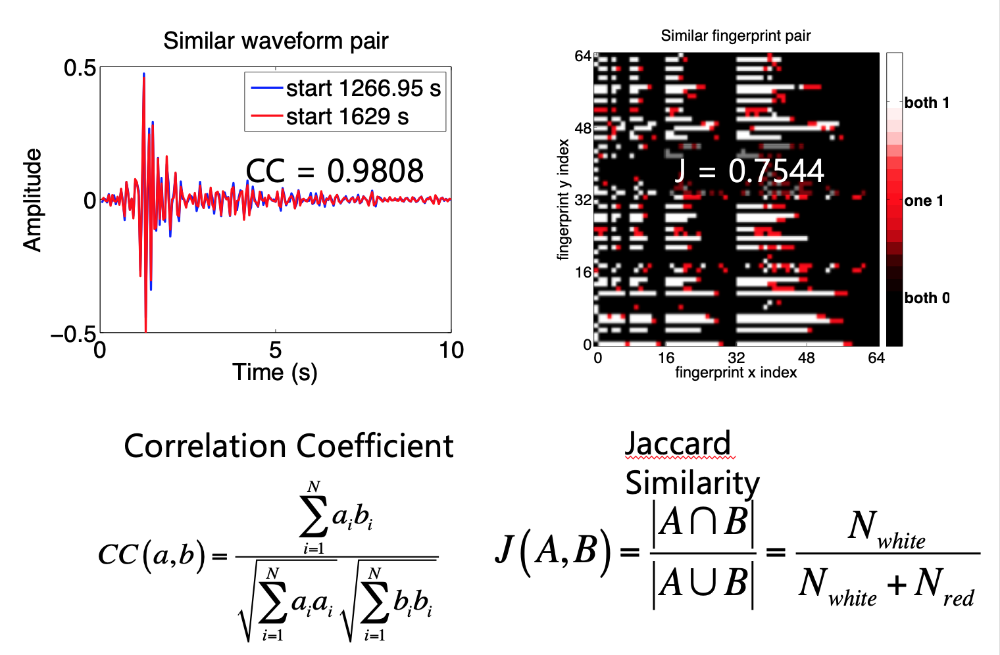

# **Fingerprint**

## Feature Extraction Overview

  

### Step 1: Time Series --> Spectrogram


### Step 2: Spectrogram --> Spectral Images

* To find short duration events, divide spectrogram into overlapping spectral images  
    * Long lag --> fewer spectral images to compare --> fast

  

### Step 3: Spectral Image --> Wavelet Transform

* Goal: compress nonstationary seismic signal  
    * Compute 2D discrete wavelet transform (Haar basis) of spectral image to get wavelet coefficients

  

### Step 4: Spectrogram --> Spectral Images  

* Key discriminative features are concentrated ina few wavelet coefficients with highest deviation  
    * Deviation defined by median/MAD over entire data set
    * Keep only sign (+ or -) of these coefficients, set rest to 0
* Data compression, robust to noise

  

### Step 5: Spectrogram --> Spectral Images  

* Fingerprint must be compact and sparse to store in database  
    * Convert top coefficients to a binary sequence of 0’s, 1’s
        * Negative: 01, Zero: 00, Positive: 10

  

### How do we measure similarity?  

  

### Fingerprint parameters

```
{
    "fingerprint": {
        "sampling_rate": 20,                # Sampling rate (Hz)
        "min_freq": 0.0,                    # Bandpass frequency (Hz) - minimum
        "max_freq":, 10.0,                  # Bandpass frequency (Hz) – maximum
        "spec_length": 6.0,                 # Time window length (s) for spectrogram
        "spec_lag": 0.2,                    # Time window lag (s) for spectrogram
        "fp_length": 32,                    # Spectral image length (samples)
        "fp_lag": 5,                        # Spectral image lag (samples)
        "k_coef": 200,                      # Number of wavelet coefficients to keep
        "nfreq": 32,                        # Final spectral image width (samples)
        "mad_sampling_rate": 1,             # Median/MAD sampling fraction of data
        "mad_sampling_interval": 86400      # Median/MAD sampling frequency (s)
    }
}
```  

!!! note
    Need one input file per component at each station:  
    ```
    parameters/fingerprint/fp_input_${NETWORK}_${STATION}_${CHANNEL}.json
    ```  
    **Example:** `fp_input_CI_CDY_EHZ.json`  

### How to select bandpass filter?  

* Filter can be different for different stations and components  
* Contain as much of your desired earthquake signal as possible; not too narrowband  
* Remove frequencies with repeated noise: ^^important^^  
  * View sample spectrograms to empirically determine these noisy frequencies (output as .png image files):
  ```
    parameters/preprocess_utils/sample_spectrograms_daily _NEP.py
  ```
      * Twice a day (day and night: cultural noise variations)
      * Once a month or once a day – sample randomly

  * Usually 0-2 Hz has repeated noise; sometimes >20 Hz
  * ^^Without this step, similar noise signals will dominate your detections --> you will not find earthquakes^^  

* May want to avoid teleseismic event detection
    * Lower limit 3-4 Hz

* 4-12 Hz generally works well as default

### **Example:** Bandpass filter selection, given sample spectrogram