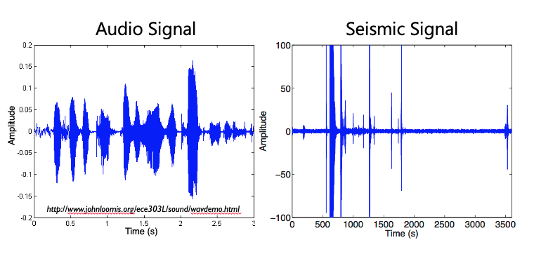
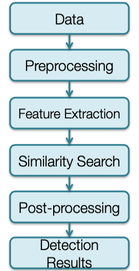
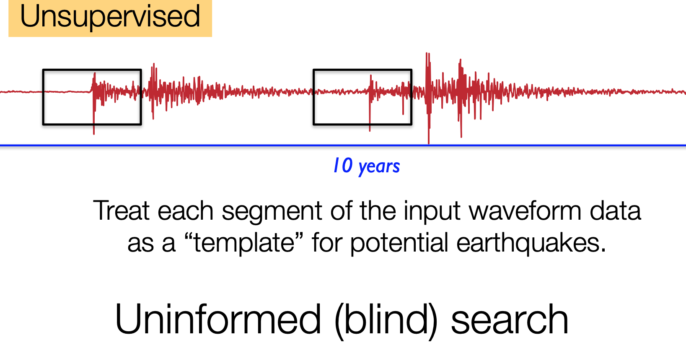

# **FAST Overview**

## **What is FAST?**

FAST is an end-to-end and unsupervised earthquake detection pipeline—it does not require any examples of known event waveforms or waveform characteristics for detection. This allows FAST to discover new earthquake sources, even if template waveforms (training data) is not available. It takes continuous seismic data from multiple stations as input and outputs a list of time stamps for potential detections. FAST draws on techniques used by content-based audio recognition systems (like the [Shazam app](https://www.toptal.com/algorithms/shazam-it-music-processing-fingerprinting-and-recognition), or Google's [Waveprint](https://www.toptal.com/algorithms/shazam-it-music-processing-fingerprinting-and-recognition) algorithm), and adapts these methods for the unique characteristics of seismic waveform data.

FAST was designed to complement existing energy-based detection methods like STA/LTA in order to find previously unknown earthquakes, especially small earthquakes, in seismic data.
  

  
  
The image to the right gives an overview of the FAST pipeline, which involves gathering continuous seismic data, preprocessing the data with a bandpass filter, running FAST for feature extraction to get binary fingerprints, running a similarity search with MinHash and Locality Sensitive Hashing, post-processing to identify events and clean up the data, and outputting the detection results.

  
  
  

## **Standard Earthquake Detection (STA/LTA)**

<mark>Ratio: Short Term Average / Long Term Average</mark>

Traditionally, an earthquake is detected at one station at a time, using an energy detector such as a short-term average (STA)/long-term average (LTA). STA/LTA computes the ratio of the STA energy in a short time window to the LTA energy in a longer time window, as these windows slide through the continuous data. A detection is declared when the STA/LTA ratio exceeds certain thresholds. An association algorithm then determines whether detections at multiple stations across the network are consistent with a seismic source. If a seismic event is detected at a minimum of four stations, it is included in an earthquake catalog, which is a database of the location, origin time, and magnitude of known earthquakes. 

STA/LTA successfully identifies earthquakes with impulsive, high signal-to-noise ratio (snr) P-wave and S-wave arrivals presented below. 

STA/LTA rates high on general applicability, which we define as the ability to detect a wide variety of earthquakes without prior knowledge of the event waveform or source information. But STA/LTA fails to detect earthquakes, or may produce false detections, in more challenging situations such as low snr, waveforms with emergent arrivals, overlapping events, cultural noise, and sparse station spacing; thus, STA/LTA has low detection sensitivity as shown below. 

Therefore, earthquake catalogs are incomplete for lower-magnitude events. Read more [here](https://www.ncbi.nlm.nih.gov/pmc/articles/PMC4672764/#__sec1title).

## **Waveform Similarity**

Many algorithms have been developed to efficiently search for similar items in massive data sets; applications include identifying similar files in a large file system, finding near-duplicate Web pages, detecting plagiarism in documents, and recognizing similar audio clips for music identification, such as in the Shazam mobile app. We can meet our objective of a fast, efficient, automated blind detection of similar earthquake waveforms in huge volumes of continuous data by leveraging scalable algorithms that are widely used in the computer science community. Seismologists are just beginning to exploit data-intensive search technologies to analyze seismograms; one recent application is an earthquake search engine for fast focal mechanism identification that retrieves a best-fit synthetic seismogram from a large database, whereas another study developed a fast-approximation algorithm to find similar event waveforms within large catalogs.

Rather than directly comparing waveforms, we first perform feature extraction to condense each waveform into a compact “fingerprint” that retains only its key discriminative features. A fingerprint serves as a proxy for a waveform; thus, two similar waveforms should have similar fingerprints, and two dissimilar waveforms should have dissimilar fingerprints. We assign the fingerprints (rather than waveforms) to LSH hash buckets.

Our approach, an algorithm that we call **Fingerprint And Similarity Thresholding (FAST)**, builds on the Waveprint audio fingerprinting algorithm, which combines computer-vision techniques and large-scale data processing methods to match similar audio clips. We modified the Waveprint algorithm based on the properties and requirements of our specific application of detecting similar earthquakes from continuous seismic data. We chose Waveprint for its demonstrated capabilities in audio identification and its ease of mapping the technology to our application.  

First, an audio signal resembles a seismogram in several ways: they are both continuous time series waveform data, and the signals of interest are often nonimpulsive. Second, Waveprint computes fingerprints using short overlapping audio clips, as in autocorrelation. Third, Waveprint takes advantage of LSH to search through only a small subset of fingerprints. Waveprint also reports fast retrieval results with high accuracy, and its feature extraction steps are easily parallelizable. FAST scores high on three qualitative desirable metrics for earthquake detection methods (detection sensitivity, general applicability, and computational efficiency), whereas other earthquake detection algorithms (STA/LTA, template matching, and autocorrelation) do well on only two of the three.  

<figcaption>Waveform similarity allows detection of smaller earthquakes.</figcaption>
  

<figcaption>A comprehensive, exhaustive search for earthquakes with similar waveforms.</figcaption>

## **Efficient Search**

FAST identifies candidate earthquake waveforms using a blind search for similar waveforms
in single-channel continuous ground motion data. Rather than using a brute-force search in
the time domain, as in the autocorrelation method (Brown et al., 2008), FAST searches for
similar waveform fingerprints using an efficient indexing and search procedure.

The FAST similarity search involves two steps: the first is indexing a set of database
fingerprints, and the second is querying the index to identify similar waveform fingerprints.
Because FAST assumes no prior information about waveform signatures, we set up the
similarity search in a manner that will identify any repeating or similar signals among the
full set of waveform fingerprints. Therefore, in FAST similarity search we store the full set of
fingerprints in the search index and we also use the full set of fingerprints as queries against
the index, in a true blind search. The index is designed such that for each query fingerprint,
FAST can identify similar fingerprints without having to scan the entire index. Rather
than an exhaustive search, FAST performs an approximate similarity search, guaranteed
to identify similar waveforms with high probability, which enables improved scalability and
reduced runtime.

<figcaption>Efficient search for similar items in large databases</figcaption>

## **What can and can't FAST do?**

Typical use cases of FAST include weeks, months, or years of continuous seismic data at several stations, which FAST scans through to find small similar (or repeating) earthquakes.

FAST will not detect an earthquake that occurs **only once** and is **not similar enough** to any other earthquakes in your continuous data set.

Most similar earthquakes **!=** largest earthquakes. 

* Larger earthquakes often match a smaller earthquake on the coda, so they are detected with lower similarity (or not detected at all).

FAST is intended to complement (not replace) existing energy-based detection methods like STA/LTA.