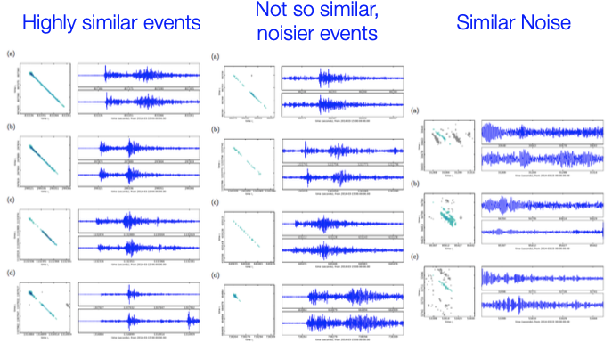
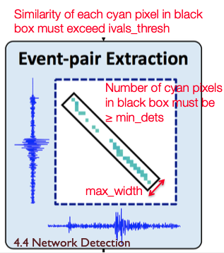

# **Network Detection** 

  

### Association: Detect Earthquakes Over a Seismic Network  

Earthquake pair at different stations: consistent inter-event time dt Reduce false detections  

  

### Network (Multi-Station) Detection with FAST  

  

### Network (Multi-Station) Illustration  

  

### Event-Pair Extraction Parameters  

```
    "network": {
        "dgapL": 3,                 # Longest allowed along-diagonal time gap (samples)  
        ”dgapW": 3,                 # Longest allowed cross-diagonal time gap (samples)  
        ”num_pass": 2,              # Adjacent diagonal merge iterations  
        ”ivals_thresh": 6,          # Minimum similarity (number of votes)  
        “min_dets": 4,              # Minimum number of fingerprint-pairs in a cluster  
        ”min_sum_multiplier": 1,    # Minimum total similarity multiplier for a cluster  
        "max_width": 8,             # Maximum bounding box width (samples)  
    }
```  

**Guidelines for setting parameters:**  

* ivals_thresh = nvote, **unless initial threshold is too low**. **Better approach is increasing** min_sum_multiplier (i.e. min_sum_multiplier = updated_nvote / nvote ) **which effectively increases fingerprint-pair threshold to** updated_nvote **with better thresholding that takes advantage of structure of event-pairs**  
* min_dets = 4-6  
* dgapL: **time interval equivalent to largest expected P-S gap (e.g. 10-20 seconds)**  
* dgapW: **should be small, equivalent to a few seconds (3-4 seconds)** 

```
    "network": {
        “max_fp": 74797,    # Max fingerprint index over all stations  
        ”dt_fp": 1.0,       # Fingerprint lag (s)  
        "dgapL": 3,         # Longest allowed along-diagonal time gap (samples)  
        ”dgapW": 3,         # Longest allowed cross-diagonal time gap (samples)  
        ”num_pass": 2,      # Adjacent diagonal merge iterations
    },
```  

  

<figcaption>Event-Pair Extraction Parameters (1 Station)</figcaption>  

* `dgapL`, `dgapW`: determine whether to keep as 1 cluster or split into 2 clusters  
    * Multiply `dgapL`, `dgapW` by dt_fp to get values in seconds

* `num_pass`=2 is good default (3 is also ok, but takes longer)  

### Event-Pair Extraction Samples  

  

```
    "network": {
        ”ivals_thresh": 6,              # Minimum similarity (number of votes)  
        “min_dets": 4,                  # Minimum number of fingerprint-pairs in a cluster  
        ”min_sum_multiplier": 1,        # Minimum total similarity multiplier for a cluster  
        "max_width": 8,                 # Maximum bounding box width (samples)  
    },
```  

  

<figcaption>Event-Pair Pruning Parameters (1 Station)</figcaption>  

* Set higher thresholds on similarity in order to identify an event-pair cluster Minimum total similarity threshold: `ivals_thresh` * `min_dets` * `min_sum_multiplier`  
* `max_width`: 8 is a good default value, probably don’t need to change  
    * multiply by dt_fp to get value in seconds  

```
    "performance": {
        "partition_size": 2147483648,  
        "num_cores": 4  
    }
```  

* `partition_size`: Maximum size of each partition (bytes), if entire list of similarity search output pairs does not fit into memory
* `num_cores`: Number of threads for parallel processing (event-pair extraction only)  

