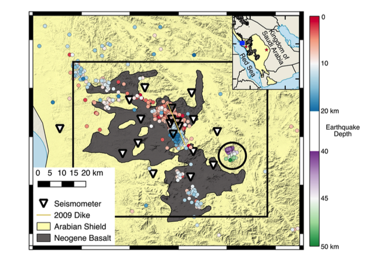
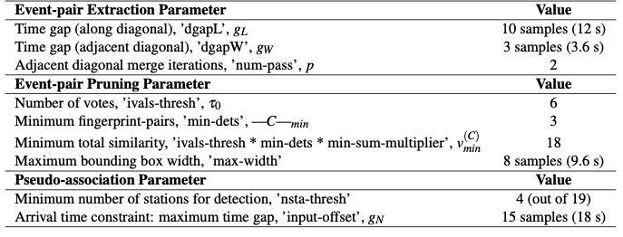

# 0.4 sSaudi Arabia, May 2014

<figcaption>Figure 5: Map of 19 stations (white triangles) in Saudi Arabia used for FAST detection from 2014-05-01 to 2014-06-01. Catalog earthquakes are colored by depth; mantle earthquakes are circled. This figure was created by Alex Blanchette.</figcaption>  

!!! info
    Seismic network from Saudi Arabia to study dike swarms in volcanic area, and deep mantle earthquakes. 1 month continuous data (2014-05-01 to 2014-06-01), at 19 stations (Figure 5), 55 channels (3 components per station, except LNY11 where only HHN was used), provided by Alex Blanchette of Stanford Geophysics.  

Table S7: Preprocessing parameters for Saudi Arabia May 2014 earthquake detection, for each station (same filter applied to all components), 1 month continuous data (2014-05-01 to 2014-06-01), at 19 stations, decimate to 25 Hz. Also, all time gaps with 0’s were filled with uncorrelated random noise. For station LNY11, only HHN component was used in similarity search, as the HHE and HHZ components had too much correlated noise.  

  

Table S8: FAST input parameters for Saudi Arabia May 2014 earthquake detection, applied to each component at each station. For the median statistics calculation (for wavelet coefficient selection), we randomly sampled 10% of the data, once per day. Total number of fingerprints (largest number over all channels): 2,231,989.  

  

Table S9: Network detection input parameters for Saudi Arabia May 2014 earthquake detection at 19 stations, after getting similar pairs of fingerprints from FAST for each station — added similarity from all 3 [HHE,HHN,HHZ] components at a given station and set station-pair threshold of (v=2)*(3 components) = 6.  

  

Table S10: Final thresholds for Saudi Arabia May 2014 earthquake detection, applied to network detection parameters *nsta* (number of stations that detected event pair) and *peaksum* (total similarity score at all stations) to determine list of earthquakes, set empirically after visual inspection. For each value of *nsta*, a different threshold for *peaksum* can be applied.  

  

  

<figcaption>Figure 6: Saudi Arabia earthquake detections from 2014-05-01 to 2014-06-01. The vertical axis indicates a measure of network FAST similarity: nsta*peaksum (Table S10). FAST detected a total of 1,837 earthquakes during this month.</figcaption>  