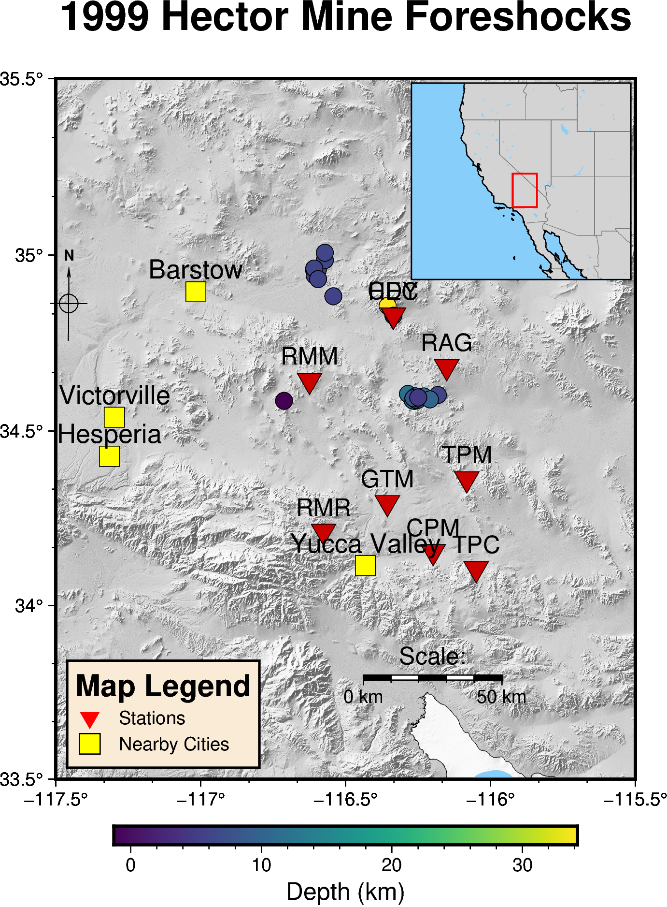

# **Installation for Docker**

[Docker](https://www.docker.com/) is an open-source project for automating the deployment of applications as portable, self-sufficient containers that can run on the cloud or on-premises. ([Source](https://docs.microsoft.com/en-us/dotnet/architecture/microservices/container-docker-introduction/docker-defined))

## **Install Docker**
Install Docker on your machine [here](https://www.docker.com/products/docker-desktop/). To get started, make sure Docker has been successfully installed by running:

``` bash
$ docker run hello-world
```

You should see the `Hello from Docker!` message displayed. Otherwise, refer to Docker's documentation for getting started [here](https://www.docker.com/get-started/).

!!! warning
    By default, Docker for Mac allocates **2.00GB of RAM**. The more memory available on Docker, the faster FAST will run. Please refer to [**Docker's Docker Desktop for Mac user manual**](https://docs.docker.com/desktop/mac/#resources) for more information on how to increase the allocated memory.

## **Setting up Docker for FAST**

 Create a directory for FAST code and outputs

``` 
$ mkdir DockerFAST
```  

Change permissions so that Docker can write to this directory

```
$ chmod 777 DockerFAST
```

Clone the FAST repository from GitHub

```
$ cd DockerFAST
$ git clone https://github.com/stanford-futuredata/FAST
```

Build the Docker image

!!! note
    Building the Docker image with Dockerfile with set up all FAST dependencies (Linux Ubuntu 18.04, CMake compiler, C++ boost, conda for python virtual environment and libraries).

```
$ cd FAST
$ docker build -f Dockerfile -t fast_image:0.1 .
```

* `-f` - Name of the Dockerfile
* `-t` - Tag name

Run the Docker image in a Docker container

```
$ docker run -v ${PWD}:/app -it fast_image:0.1 /bin/bash
```

* `-v` - Bind mount a volume
* `-it` - Short for --interactive + --tty, which takes you inside the container

## **Running FAST with Docker**

### Generate fingerprints for the data set

```
root@555d364b63d7:/app/FAST# python run_fp.py -c config.json
```

### Search for Similar Earthquakes

```
root@555d364b63d7:/app/FAST# cd simsearch/
root@555d364b63d7:/app/FAST/simsearch# cmake .
root@555d364b63d7:/app/FAST/simsearch# make
root@555d364b63d7:/app/FAST/simsearch# cd ..
root@555d364b63d7:/app/FAST# python run_simsearch.py -c config.json
```

### Parse FAST Similarity Search Output

```
root@555d364b63d7:/app/FAST# cd postprocessing/
root@555d364b63d7:/app/FAST/postprocessing# ../parameters/postprocess/output_HectorMine_pairs.sh
root@555d364b63d7:/app/FAST/postprocessing# ../parameters/postprocess/combine_HectorMine_pairs.sh
root@555d364b63d7:/app/FAST/postprocessing# python scr_run_network_det.py ../parameters/postprocess/7sta_2stathresh_network_params.json
```

### Postprocess: Network Detection

```
root@555d364b63d7:/app/FAST/postprocessing# cd ../utils/network/
root@555d364b63d7:/app/FAST/utils/network# python arrange_network_detection_results.py
root@555d364b63d7:/app/FAST/utils/network# ./remove_duplicates_after_network.sh
root@555d364b63d7:/app/FAST/utils/network# python delete_overlap_network_detections.py
root@555d364b63d7:/app/FAST/utils/network# ./final_network_sort_nsta_peaksum.sh
```

### Visualize the FAST Output

```
root@555d364b63d7:/app/FAST/utils/network# cat ../../data/network_detection/sort_nsta_peaksum_7sta_2stathresh_FinalUniqueNetworkDetectionTimes.txt
```

### Display Waveforms for FAST Detections in Descending Order of "Peaksum" Similarity

```
root@555d364b63d7:/app/FAST/utils/network# cd ..
root@555d364b63d7:/app/FAST/utils# cd events/
root@555d364b63d7:/app/FAST/utils/events# python PARTIALplot_detected_waveforms_HectorMine.py 0 100
```

!!! note
    View images outside Docker container — determine detection threshold.  
    `$ /Users/user_name/Documents/DockerFAST/FAST/data/network_detection/7sta_2stathresh_NetworkWaveformPlots/`

### Set Detection Threshold

!!! note
    Setting the detection threshold will make everything above it an earthquake.  

```
root@555d364b63d7:/app/FAST/utils/events# cd ../../data/network_detection/
root@555d364b63d7:/app/FAST/data/network_detection# head -50 sort_nsta_peaksum_7sta_2stathresh_FinalUniqueNetworkDetectionTimes.txt > EQ_sort_nsta_peaksum_7sta_2stathresh_FinalUniqueNetworkDetectionTimes.txt
```

### Output Final FAST Detected Event List

```
root@555d364b63d7:/app/FAST/data/network_detection# cd ../../utils/events/
root@555d364b63d7:/app/FAST/utils/events# python output_final_detection_list.py
root@555d364b63d7:/app/FAST/utils/events# cat ../../data/network_detection/FINAL_Detection_List_HectorMine_7sta_2stathresh.txt
```

<br></br>

!!! info
    The following tutorials are not a part of FAST but are optional steps to take for phase picking and earthquake location using SeisBench, HYPOINVERSE, and PyGMT.

## **Phase Picking**  

### Cut SAC Files  

* Cut the continuous seismic data based on the detection results from FAST  

```
root@555d364b63d7:/app/utils/events# python cut_event_files.py
```  

* Check for cut files in:  

```
root@555d364b63d7:/app/data/event_ids#  
```

* Example:  


### Install SeisBench  

```
root@555d364b63d7:/app/utils/events# cd ../..
root@555d364b63d7:/app# pip install seisbench
```

### Pick Phases (automatically)  

* Run SeisBench script for all events and all stations

```
root@555d364b63d7:/app# cd utils/picking
root@555d364b63d7:/app/utils/picking# python run_seisbench.py
```  

* Annotated plots are found in:  

```
root@555d364b63d7:/app/data/seisbench_picks
```  


* Example annotated plot from event 00000000:  


Output saved in:

```
root@555d364b63d7:/app/utils/picking/event_picks.json/
```  
Example output:  


* "peak_time": Arrival time of pick
* "peak_value": Probability of pick

## **Earthquake Location**  

The output from `run_seisbench.py` in the `event_picks.json` file contains the information needed to locate the detected earthquakes from the FAST final detection list. We use HYPOINVERSE to locate earthquakes from the picks found with `run_seisbench.py`.  

HYPOINVERSE is the standard location program supplied with the Earthworm seismic acquisition and processing system (AQMS). Read more about it [here](https://www.usgs.gov/software/hypoinverse-earthquake-location).  

### Locate Earthquakes  

To begin earthquake location run the following to format the phase picks for HYPOINVERSE:  

```
root@555d364b63d7:/app/utils/picking# cd ..
root@555d364b63d7:/app/utils# cd location
root@555d364b63d7:/app/utils/location# python SeisBench2hypoinverse.py
```  

### Install and Run HYPOINVERSE

1. Download HYPOINVERSE [here](https://www.usgs.gov/software/hypoinverse-earthquake-location)    
2. Expand the hyp1.40.tar file
3. Move to `root@555d364b63d7:/app/utils/location`

Move the following files from `root@555d364b63d7:/app/utils/location/` to `root@555d364b63d7:/app/utils/location/hyp1.40/source/`:  

   *   eqt_get_station_list.py
   *   hadley.crh
   *   locate_events.hyp
   *   output_hypoinverse_as_text.py
   *   output_station_file.py
   *   utils_hypoinverse.py

Check that GFortran is installed:  

```
root@555d364b63d7:/app# gfortran --version
```  

Example expected output:  
==GNU Fortran (Ubuntu 7.5.0-3ubuntu1~18.04) 7.5.0==  

If GFortran is not installed, run:  
```
root@555d364b63d7:/app# apt-get install gfortran  
```

Make changes to `makefile` in `root@555d364b63d7:/app/utils/location/hyp1.40/source`:  

* Comment lines **16** and **230**  

```  py linenums="16"
# cp hyp1.40 /home/calnet/klein/bin
```  

```  py linenums="230"
# cp p2sdly /home/calnet/klein/bin
```  

* Find and replace: g77 with gfortran

Save changes and exit  

**Check that HYPOINVERSE works**:  

* Compile hypoinverse:  
```
root@555d364b63d7:/app/utils/location/hyp1.40/source# make 
```  

* Make it executable:  
```
root@555d364b63d7:/app/utils/location/hyp1.40/source# chmod +x hyp1.40
```  

* Run HYPOINVERSE:  
```
root@555d364b63d7:/app/utils/location/hyp1.40/source# ./hyp1.40
```  

* Expcted output:  
```
HYPOINVERSE 2000 STARTING
6/2014 VERSION 1.40 (geoid depth possible)
 COMMAND?
```   

If you have this output, HYPOINVERSE is running correctly. Press ctrl-c to exit.

### Formatting data for HYPOINVERSE

Get Hector Mine Station List as a json file:  
```
root@555d364b63d7:/app/utils/location# python eqt_get_station_list.py
```

Output:  
```
station_list.json
```

Convert `station_list.json` to `station_list.sta`:  
```
root@555d364b63d7:/app/utils/location# python output_station_file.py
```  

### Run HYPOINVERSE  

To run HYPOINVERSE:  
```
root@555d364b63d7:/app/utils/location/hyp1.40/source# ./hyp1.40
```  

Use **@locate_event.hyp** as input:
```
HYPOINVERSE 2000 STARTING
6/2014 VERSION 1.40 (geoid depth possible)
 COMMAND? @locate_events.hyp
```  

Expected output:
   

You should see output files called locate_events.sum and locate_events.arc, but these are difficult to read.  

!!! note
    locate_events.arc has the event info, and phase pick info for each event. locate_events.sum has only the event info, no phase pick info.

Use `output_hypoinverse_as_text.py` to output `locate_events.sum` in a more readable format.  

```
root@555d364b63d7:/app/utils/location# python output_hypoinverse_as_text.py  
```

## **Plotting Earthquake Locations with PyGMT**

### Install PyGMT

```
root@555d364b63d7:/app# conda install -c conda-forge pygmt
```  

### Run `hypoinverse_to_pygmt.py`

```
root@555d364b63d7:/app/utils/location# python hypoinverse_to_pygmt.py  
```  

Figure saved as `hypoinverse_to_pygmt.png` in `root@555d364b63d7:/app/utils/location/`

**Map Output**:  



## **Exiting the Docker Container**

```
root@555d364b63d7:/app/FAST/utils/events# exit
exit
```